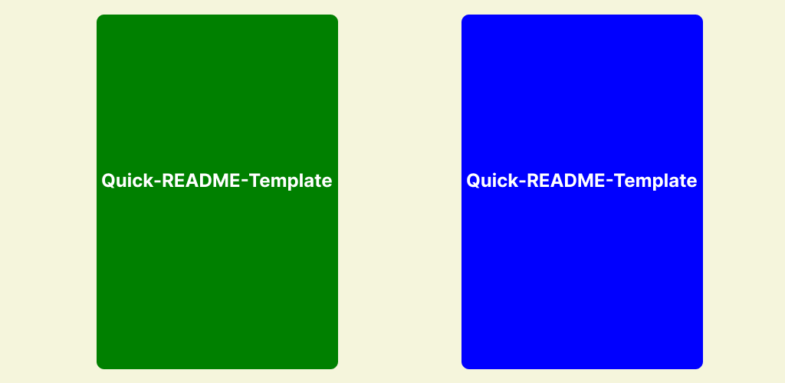

<!-- Hi there, If you are reading this, This is a Readme sample to the readme template.
The purpose behind this readme template is to help you create a quick readme to your project and focus on the important aspect which is coding and the likes. It is simple and easy to use.
 -->
<!--To have a better understanding, I am building this readme file to show what the readme would look like, Checkout the BLANK_README.md file to create your own readme file  -->

<!-- NAME OF THE PROJECT -->
## Quick-README-Template
[](https://www.example.com)
<!-- Short description of project if you want -->
With Quick-readme you can spend less time worrying about whether or not your initial documentation is good, and spend more time writing and using code.

---
<!-- TABLE OF CONTENTS -->
<details>
   <summary>Table of Contents</summary>
  <ol>
    <li>
      <a href="#about-the-project">About The Project</a>
      <ul>
        <li><a href="#built-with">Built With</a></li>
      </ul>
    </li>
    <li>
      <a href="#getting-started">Getting Started</a>
      <ul>
        <li><a href="#prerequisites">Prerequisites</a></li>
        <li><a href="#installation">Installation</a></li>
      </ul>
    </li>
    <li><a href="#usage">Usage</a></li>
    <li><a href="#contributing">Contribution</a></li>
    <li><a href="#contact">Reference</a></li>
    <li><a href="#license">License</a></li>
    <li><a href="#acknowledgments">Author Info</a></li>
  </ol>
</details>

---
<!-- ABOUT THE PROJECT -->
## About The Project

I want to create a README template so amazing that it'll be the last one you ever need -- I think this is it.

Here's why:
* Quick-README is designed for all types of libraries, Which it applies to all languages and package managers
* Your time should be focused on creating something amazing. A project that solves a problem and helps others
* You shouldn't be doing the same tasks over and over like creating a README from scratch:cry:

I'll be adding more features in the near future. You may also suggest changes by forking this repo and creating a pull request or opening an issue. Thanks :heart::heart:

Use the `BLANK_README.md` to get started.

<p align="right">(<a href="#readme-top">back to top</a>)</p>

---

### Built With

This section should list any major frameworks/libraries used to bootstrap your project. Here are a few examples.
<!--These are the available list of badges. If your badge isn't there, you can visit one of the links and change the name and logo of the library to the library you need.-->

<div align="center">
  
  
  
  
  
  
  
  
  
  
  
</div>

<p align="right">(<a href="#readme-top">back to top</a>)</p>
[Back To The Top](#QUICK-README)

---

<!-- GETTING STARTED -->
## Getting Started

This is an example of how you may give instructions on setting up your project locally

### Prerequisites
<!-- Guideline on installing software -->
To use the software, you will need to install the necessary items and follow the instructions on how to list and install them. An example is provided to help guide you through the process.

* npm
  ```
  npm install npm@latest -g
  ```

### Installation

An example of how to provide instructions to your audience on installing and setting up your app is as follows

1. Clone the repo
   ```sh
   git clone https://github.com/your_username_/Project-Name.git
   ```
2. Install NPM package
   ```sh
   npm install
   ```
3. Start project
   ```sh
   npm start
   ```

<p align="right">(<a href="#readme-top">back to top</a>)</p>

---

<!-- USAGE EXAMPLES -->
## Usage

In this space, you can provide useful examples of how your project can be utilized. This may include screenshots, code examples, demos, and links to additional resources. Additional materials such as these can help showcase the capabilities of your project.

<div align="center">

</div>

<p align="right">(<a href="#readme-top">back to top</a>)</p>

---

<!-- CONTRIBUTION -->
## Contribution

Contributions are what make the open source community such an amazing place to learn, inspire, and create. Any contributions you make are **greatly appreciated**.

If you have a suggestion that would make this better, please fork the repo and create a pull request. You can also simply open an issue with the tag "enhancement".
Don't forget to give the project a star! Thanks again!:thumbsup:

1. Fork the Project
2. Create your Feature Branch (`git checkout -b feature/ImproveFeature`)
3. Commit your Changes (`git commit -m 'Add some ImproveFeature'`)
4. Push to the Branch (`git push origin feature/ImproveFeature`)
5. Open a Pull Request

<p align="right">(<a href="#QUICK-RREADME">back to top</a>)</p>